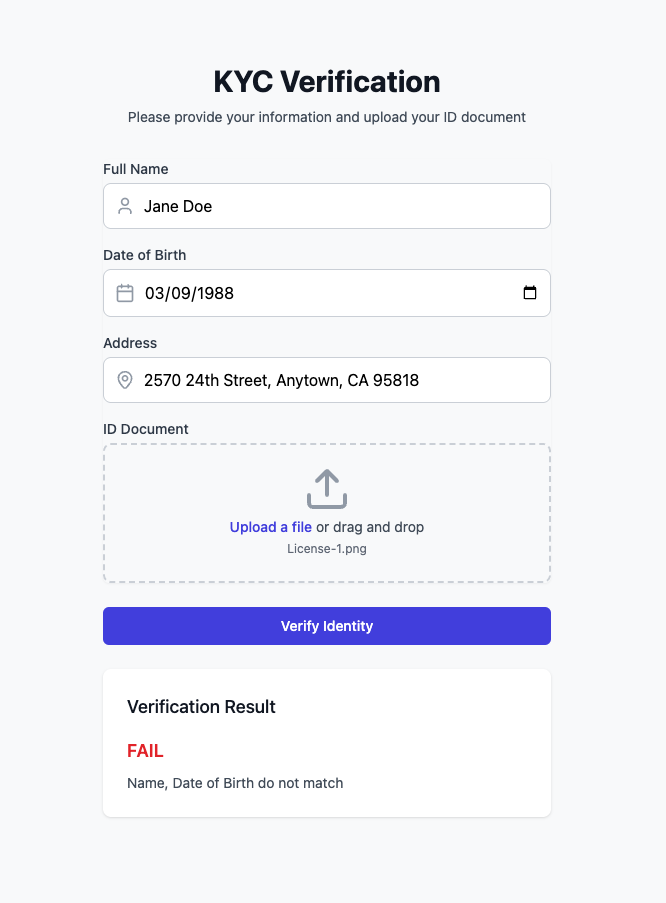
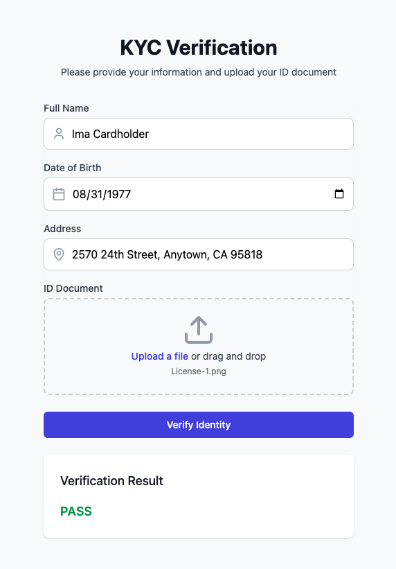
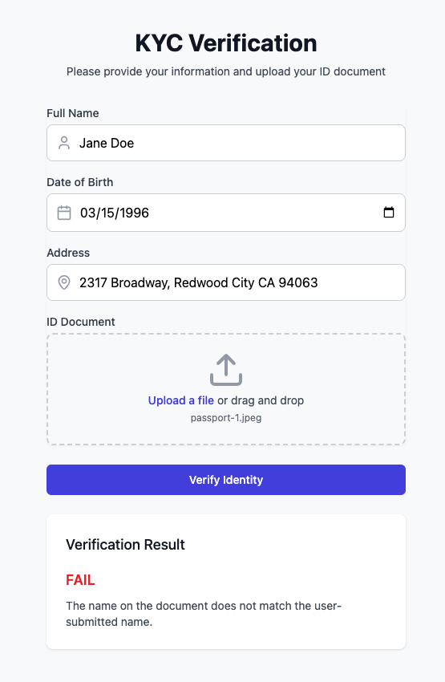
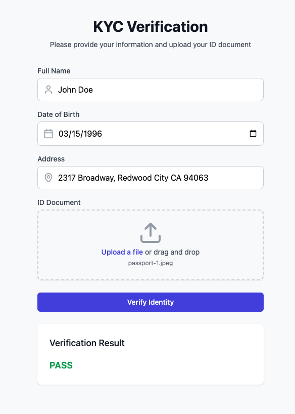

# Technical Implementation Notes

## Prompt Design and Implementation

One of the key challenges in implementing this KYC system was designing effective prompts that would work reliably with the AI models while respecting privacy concerns. The system uses two distinct prompts for different stages of the verification process.

### Document Analysis Prompt
```text
Can you describe this image? Output the format in json in this format 
DOB, LN, FN, DL, EXP, Address, Sex, HGT, WGT, HAIR, EYES, ISS, type of document
```

#### Design Decisions:
- **Neutral Language**: Uses "describe this image" rather than terms like "extract", "identify", or "PII"
- **Structured Output**: Requests specific fields in a defined format
- **Universal Fields**: Selected fields that work for both passports and driver's licenses
- **JSON Format**: Ensures consistent, parseable responses
- **Simple Instructions**: Avoids complex or multi-step instructions that might confuse the model

#### Technical Implementation:
```python
messages=[{
    "role": "user",
    "content": [{
        "type": "text",
        "text": "Can you describe this image? Output the format in json in this format DOB, LN, FN, DL, EXP, Address, Sex, HGT, WGT, HAIR, EYES, ISS, type of document",
    }, {
        "type": "image_url",
        "image_url": {
            "url": f"data:image/jpeg;base64,{image_base64}"
        },
    }],
}]
```

### Validation Prompt
```text
Compare the user-submitted information with the document information and determine if they match.
In the event of a passport, there will not be a full address but a region, determine if the address provided is in the region of the document.
Respond with only two fields named "Result" with a value of pass or fail and "Feedback" with information why it failed, if it passed provide "none"

User submitted information:
Name: {user_data['name']}
Date of Birth: {user_data['dob']}
Address: {user_data['address']}

Document information:
Name: {document_data.get('FN', '')} {document_data.get('LN', '')}
Date of Birth: {document_data.get('DOB', '')}
Address: {document_data.get('Address', '')}
Document Type: {document_data.get('type of document', '')}

Analyze the following:
1. Name matching (accounting for formatting differences, we just want to know if the full name is present)
2. Date of birth matching
3. Address matching (accounting for abbreviations and formatting)
4. Document validity (check expiration if available)
```

#### Design Decisions:
- **Focus on Comparison**: The prompt focuses on matching rather than data extraction
- **Document-Type Awareness**: Explicitly handles differences between passports and other IDs
- **Structured Response**: Requires specific "Result" and "Feedback" fields
- **Flexible Matching**: Accounts for formatting variations in names and addresses
- **Clear Success/Failure**: Binary pass/fail output with explanatory feedback
- **Region Handling**: Special logic for passport address validation

#### Technical Considerations:
1. **Model Selection**
   - Vision Analysis: `llama-v3p2-90b-vision-instruct`
     - Chosen for its ability to process images and extract structured data
     - Works well with neutral, descriptive prompts
   - Information Validation: `llama-v3p1-405b-instruct`
     - Selected for its strong text comparison capabilities
     - Good at understanding context and variations in text

2. **Privacy Considerations**
   - Avoids terms like "PII", "sensitive", or "personal information"
   - Focuses on task-specific language
   - Treats documents as generic images with text
   - Uses neutral descriptive terms

3. **Response Handling**
   - First prompt ensures structured JSON output
   - Second prompt provides clear pass/fail with feedback
   - Both designed for easy parsing and error handling

4. **Edge Cases**
   - Handles missing fields gracefully
   - Accounts for different document types
   - Manages varying address formats
   - Deals with name format variations

### Lessons Learned
1. **Prompt Clarity**: Clear, specific instructions produce more reliable results
2. **Privacy-Aware Language**: Avoiding sensitive terms improves model cooperation
3. **Structured Outputs**: Requiring specific formats makes parsing more reliable
4. **Format Flexibility**: Accounting for variations in data representation is crucial
5. **Document-Type Awareness**: Different documents need different validation approaches


## Data Flow Process

### 1. Frontend Form Submission
- User fills out a form with personal information:
  - Full Name
  - Date of Birth
  - Address
- User uploads an identification document (passport/driver's license)
- Form data and file are packaged
- Request is sent to backend endpoint `/validate`

### 2. Backend Processing - Initial Phase
- Backend receives multipart request
- Image file is temporarily stored
- Image is encoded to base64 format for API compatibility
- Initial validation checks

### 3. Document Information Extraction
- First API call to Fireworks using `llama-v3p2-90b-vision-instruct` model
- Model specialized for vision tasks and document analysis
- Request includes:
  - Base64 encoded image
  - Structured prompt requesting specific fields
- Model extracts key information:
  - DOB (Date of Birth)
  - LN (Last Name)
  - FN (First Name)
  - DL (Driver's License number, if applicable)
  - EXP (Expiration Date)
  - Address
  - Sex
  - HGT (Height)
  - WGT (Weight)
  - HAIR (Hair Color)
  - EYES (Eye Color)
  - ISS (Issue Date)
  - Document Type
- Response is returned in JSON format

### 4. Information Validation
- Second API call to Fireworks using `llama-v3p1-405b-instruct` model
- Model specialized for text analysis and comparison
- Validation process includes:
  - Name matching (accounting for formatting differences)
  - Date of birth verification
  - Address matching (with region-specific logic for passports)
  - Document expiration check
- Prompt is structured to compare:
  - User-submitted information
  - Document-extracted information
- Returns structured response:
  - Result: "pass" or "fail"
  - Feedback: Detailed explanation or "none" for pass

### 5. Response Handling
- Backend processes validation results
- Cleans up temporary files
- Returns combined response to frontend:
  - Status
  - Validation results
  - Document data
- Frontend displays results to user:
  - Success/failure status
  - Feedback messages if applicable
  - Extracted document information

## Technical Considerations

### API Model Selection
- `llama-v3p2-90b-vision-instruct`:
  - Used for document analysis
  - Capable of processing image data
  - Optimized for structured information extraction
  
- `llama-v3p1-405b-instruct`:
  - Used for validation logic
  - Strong text processing capabilities
  - Good at comparison and analysis tasks

## Product Screenshots





### Example of the prompt recognizing the address is in the region provided by the passport
